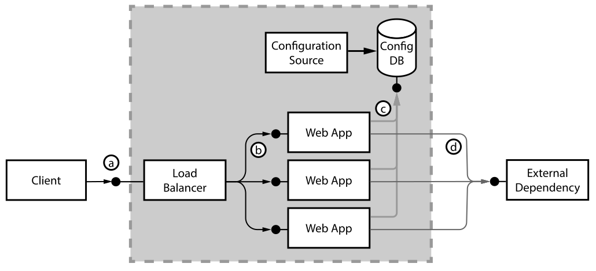
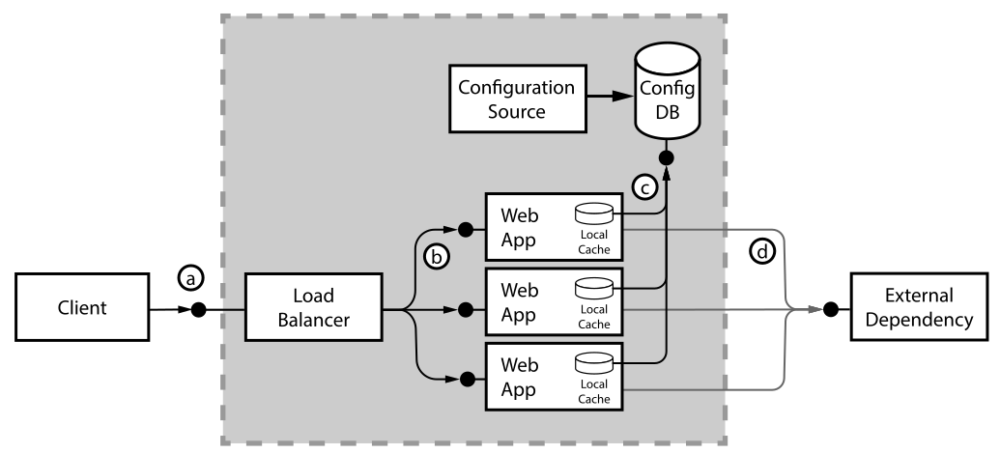
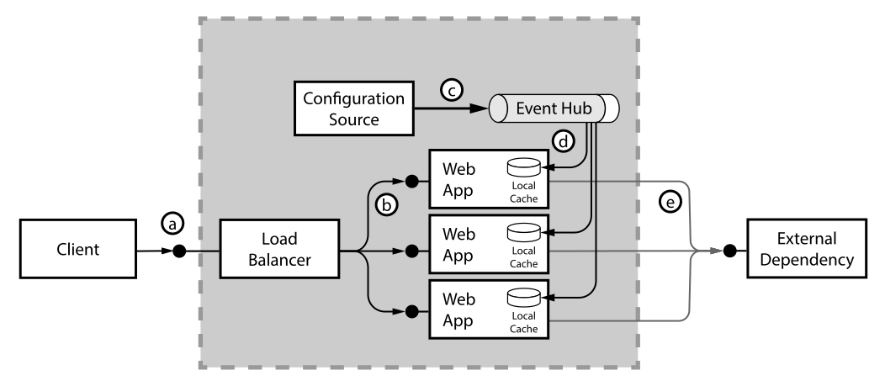
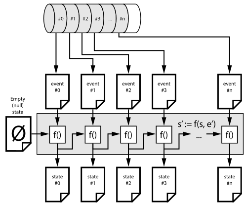
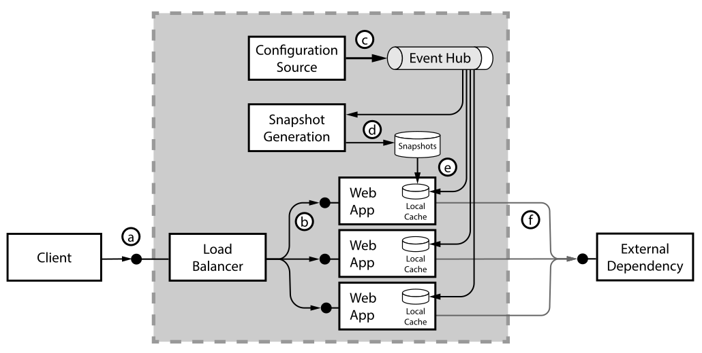
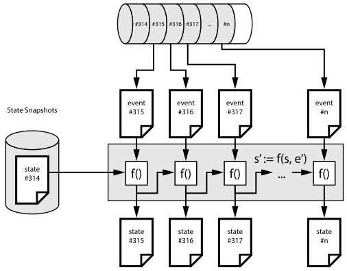
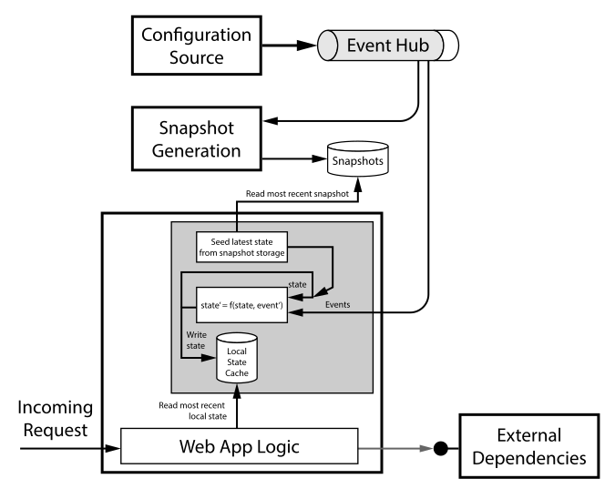
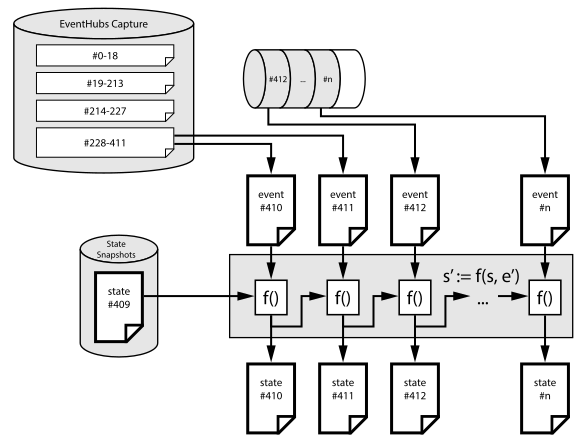

# Event-sourcing into working memory to improve data access latency

In this article, we describe a modernization, moving from a database-centric access pattern, towards event-sourcing data changes directly into the application's working memory (RAM). 

## Modernization scenario

### Introduction and a naïve starting point

The modernization started with a 'traditional' web application, which leverages both internal data, as well as calling into external APIs. In our scenario, the internal data represents configuration information necessary for the business logic in the app to handle the responses from the external APIs. An example could be an e-commerce site, which calls various external catalogues for goods, and applies business rules to the aggregated result. The internal configuration data in this scenario could e.g. be markup rules or the list of external APIs which can be called. When the business onboards a new catalogue provider, the admin team would update the internal configuration database with the new catalogue configuration. 

During request handling, the web app needs to query the internal configuration database to retrieve the current list of external dependencies such as catalogues, business rule configurations, etc.. The configuration information can change during normal operations, so the application developer has to work on a strategy to determine how often the underlying config database should be queried. In the worst case, the web application must query the configuration database multiple times, for example to determine the different external providers, as well as to retrieve per-provider business rules. 

Querying the configuration source on a per-request basis ensures to always work on the most recent configuration, but adds considerable load to the configuration database, increases the end-to-end latency of each request and therefore reduces the overall capacity of a web application node.

The diagram below describes our starting point, with the client sending requests to the load balancer (a), the load balancer distributing incoming requests to the application servers running the web application (b), and the web application querying both the configuration source (c), as well as the external dependencies (d). The *configuration source* abstractly represents the actor that changes the configuration, which could be business administrators, or automated processes.

### Caching in the ORM

Accessing a relational database like our configuration database often is implemented using an object relational mapper (ORM) technology, such as .NET Entity Framework (EF). ORMs support caching query results in memory, so that the amount of database  queries can be significantly reduced. 

In the diagram below, we represent the ORM as a 'local cache' inside the web application:

#### Going to extremes - Caching the whole database

Some customers choose a rather aggressive approach to caching: When their application servers start, they 'pre-warm' the node by **completely** querying all tables in the configuration database, to pull the complete configuration information into the application's working memory. 

The advantage of that approach is that it completely removes the necessity to query the configuration database during the request/response lifecycle, because all configuration information is cached locally. 

Unfortunately, this approach brings significant downsides: 

- **Application start times:** Application start takes a considerable amount of time, because the pre-warming process needs to download the full database, which can take quite some time. During that phase, the application is not ready to serve incoming requests. This can be a problem in scale-out situations: imagine an unforeseen spike in the number of incoming requests, for example due to a TV commercial. When a scaling logic increases the number of web servers, it would take quite some time until these additional servers can help handling traffic; the spike might actually already have created problems on the other nodes.
- **Database load:** You must also consider the load patterns on the database: During such a scale-out event, a potentially large number of servers will intensely query the database at the same time, potentially overloading the database. So a 'trampling herd' of customers in the web tier, leading to a scale-out action, might lead to a trampling herd of web servers bringing the database down.
- **Configuration updates:** Runtime updates to the configuration database are not reaching the web application any longer: When everything is cached in RAM, and the ORM no longer queries the database, it might not pull updated data from the configuration database into the application. In the past, we have seen customers who "solved" this problem by rebooting all web servers, one after the other, thus forcing each web server to re-download the entire database *again*, with the updated configuration.

### Introducing Event Sourcing into the architecture

In this web application, the configuration information should be completely kept in the working set, but we want to avoid the aforementioned disadvantages: 

The application should ...

1. ... start quickly (load the configuration data into RAM), 
2. ... do so without bringing down the configuration system, and 
3. ... configuration changes should be visible as fast as possible (without having to restart the application).

The following approach will help with the second and third requirement (we handle quick startup in the next step):

#### Event sourcing

> In this article, I use the term 'event sourcing' quite liberal: Simply speaking, all configuration change events in the system change a certain part of the overall state. 

Let's introduce event sourcing by using the simple analogy of a bank account: When a customer opens an account (which is the very first event), the account has a zero balance. When the customer receives money (a second event), the account balance is increased by the given amount. When the customer wires money to a friend, this third event in the ledger results in having a lower account balance again. The different events (account creation, credit and debit transactions, account closure) represent the banking-specific (domain) events. The account's current balance represents the 'state' of the account. Replaying (sourcing) all the events from the beginning, in the order in which they appeared, always brings leads to the same result. 

#### An "append-only log" data structure and service

As first step in refactoring the architecture, we 'replace' the configuration database with an 'append-only log' data structure. 

> The term *'log'* does not refer to log file entries (like an HTTP request log), but should be interpreted like the "captain's log" on a ship, in which all important events are written down sequentially, and historic records (the past) is not modified. 

'Append-only' means that previously written events are not modified by newly arriving events, instead new events are appended at the end of the log structure. Given that this append-only log must be read by all the web application servers, it must be centrally hosted by a service. Typical implementations of such a service include Apache Kafka, RabbitMQ Streams, or Azure Event Hubs. 

> Such an event stream could loosely be compared to a database's transaction log, in which all state changes to the various database tables are recorded sequentially as well. Replaying the transaction log allows the reconstruction of the database state, like in event sourcing.

#### Event Hub: partitions, sequence numbers and offsets

An Event Hub internally has one or more '[partitions](https://learn.microsoft.com/en-us/azure/event-hubs/event-hubs-scalability#partitions)'. A partition can be thought of as a unit of compute that hosts a single append-only commit log. When sending a message to the Event Hub endpoint, the sender can specify a 'partition key', which is a hashing function that maps the message to one of the partitions. All messages with the same partition key end up in the same partition,in which they are strictly ordered. Each message in a partition get's assigned a unique **sequence number**, a strictly monotonic increasing integer that uniquely identifies the message. For example, the very first message ever in a given partition would have sequence number #0, and the next message would have sequence number #1, and so on.

#### Pulling events into the application

The illustration demonstrates the concept: The configuration source emits state update events into Event Hub (step c), and all running web app nodes receive (pull) their individual copy of these changes (steps d). We augment the application with an active component, that pulls a copy of the stream from the append-only log structure (Azure Event Hubs service), and locally applies these events / updates / deltas to the local copy of the configuration state. 

The active component in the application needs to keep track of sequence numbers, so that the events are processed in the correct order, each event is processed exactly once, and no events are missed.

The following illustration demonstrates the foundational principle: 

- The system starts with an 'empty' (null) state, represented by the document with the `⌀` symbol. 
- We have a function `f()`, which takes in the previous state (`s`) and an event (`e'`), and generates the next version of the state (`s'`). So the equation is `s' := f(s, e')`. For example, `s_500  = f(s_499, e_500)`, i.e. the event #500 would transform state #499 into state #500.
- The very first event in the partition (`#0`) is applied to the empty `⌀` state, generating `state #0`, and so forth. Each new event would create a corresponding newer version of the state.

#### Continuously following new messages

Append-only log structures usually offer a mechanism to continuously be notified about new messages arriving at the end of the log. In a Unix-based system, one would use `tail -f /var/log/messages` to 'follow the tail' of the log file, i.e. to continuously see when new lines are appended to the log file. In Azure Event Hubs, the client can remain connected to the Event Hub via a protocol such as AMQP or AMQP over Web Sockets, so that newly arriving messages get distributed to the consumers with minimal latency.

#### Resuming operations

The state of the system depends on all events, ever received in the past. To compute the most recent state, one would have to start with an empty state store, and then re-play all events, from the beginning of time, until today. For practical purposes, that would be an unacceptable approach: when a new node in the web app joins the cluster, it would have to re-process configuration changes from months ago, just to have an up-to-date understanding of the latest configuration. 

In practice, there's a simple optimization: create state snapshots on a regular cadence. A snapshot is a (versioned) copy of the serialized state. It might say 

>  This file contains 'state #314', and describes how the state looked like after applying all events #0--#314.

To bring snapshot generation into the architecture, we introduce the "snapshot generation" component:

That component regularly computes the most recent snapshot, and serializes the state into a file in object storage, such as Azure Blob storage.

When a new (uninitialized) web app node starts (or the snapshot generator itself), it first reads the most-recent state snapshot from snapshot storage. That state file carries metadata about which *sequence number* the snapshot corresponds to. After de-serializing the state, the service positions its 'read pointer' at the right sequence number in the Event Hub partition. 

The following diagram describes that process. After reading the state #314, the component starts reading the events #315 onwards, and applies them as well, to continuously compute to the most up-to-date representation of the state.

#### Implementation internals

The internal component running in the web app could be represented like this: The function `f()` is initially fed with the most recent snapshot, and continuously feeds back the most recent state into itself, alongside with the events coming off Event Hub. The most recent state could be served within the memory of the application, such as via a global read-only property or a function call. 

Applying a state update event to the state might touch upon multiple areas of the state data structure. For example, a single update might change two or three data locations within the state type. The analogy in the database world be a transaction, that updates multiple tables or rows. It is important that the web application 'sees' a consistent view of the world, e.g. the state as it corresponded to event #314 or #315, but nothing in-between.

> Using a functional programming language with immutable (unmodifiable) data structures can be of great help here. Examples of such languages could be F#, Scala, Rust or Elixir. While the term "immutable data structure" might sound wasteful or not very useful, it refers to the programming language's ability to represent state transitions. One can say "Give me a copy of this immutable object, with that property here having a different value". Such property modifications, alongside with the fact that large parts of the state might not change, allow to re-use large parts of the object graph.

### Historic events and Event Hub Capture

The amount of events going into an append-only log data structure can potentially be huge. Therefore, the service operator needs to consider how to deal with this data growth. For example, in an Apache Kafka cluster, one might choose to 'just let it grow' and attach some more hard drives, keeping all the information around. Another approach to handle this challenge is 'log compaction', in which older messages get deleted from a partition. 

Azure Event Hub address this challenge by setting a 'message retention' or '[event retention](https://learn.microsoft.com/en-us/azure/event-hubs/event-hubs-features#event-retention)' period. Messages that are older than this period get removed from the Event Hub partition and a reader can no longer 'seek' to them and read them off the partition. The shortest duration is 24 hours, i.e. all messages that arrived within that time period for sure are readable in the partition. Older messages (like last week's ones) won't be available here. The maximum retention period varies between 7 days (for Event Hubs Standard) and 90 days (for the Premium and Dedicated SKUs).

In our Event Sourcing system, it might be necessary to read messages that are older than the retention period. For example, if the snapshot generator did not run for a longer period of time, the stored snapshots might too old. To help with that problem, **Event Hub Capture** can be enabled to fully keep track of the entire history. Enabling the Event Hub Capture feature forces the Event Hub service to regularly write older messages as Apache Avro- or Parquet-formatted files into Azure Blob storage. 

The following diagram illustrates the practical use:

In this situation, the most recent state snapshot corresponds to event #409, i.e. the next event that must be processed during state updates would be event #410 and following. Unfortunately, the oldest event in the Event Hub partition is event #412, i.e. the events #410 and and #411 cannot be read from Event Hub directly. 

However, the storage container configured for Event Hubs Capture contains Avro (or Parquet) files containing these events. So after feeding the 2 rather old events into the pipeline, the logic can 'flip over' to the Event Hubs endpoint for the more recent events.

## Summary

## Links

- [Event Sourcing pattern (Azure Architecture Center)](https://learn.microsoft.com/en-us/azure/architecture/patterns/event-sourcing)
- [Event Sourcing, Greg Young, GOTO 2014](https://www.youtube.com/watch?v=8JKjvY4etTY)
- [Why Event Sourcing is not easy, Mateusz Kubuszok, Lambda Days 2022](https://www.youtube.com/watch?v=eitMBfZgaBA)
