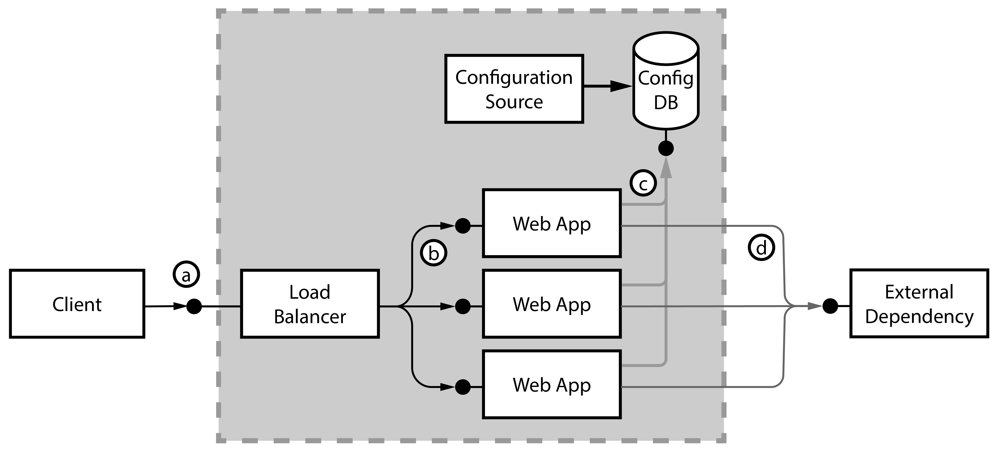
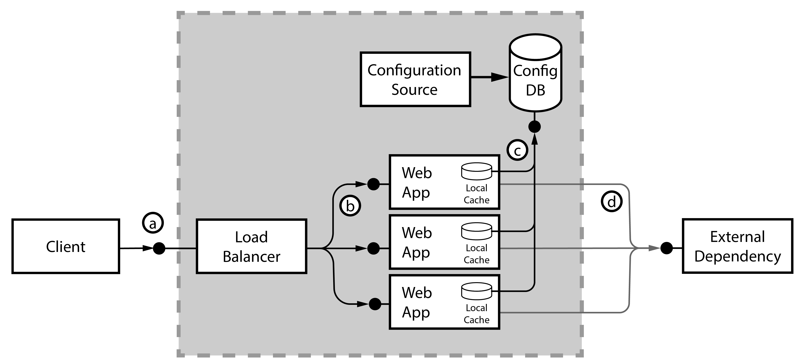
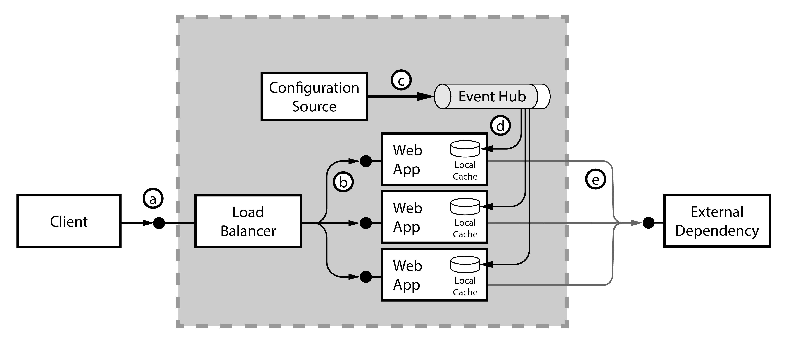
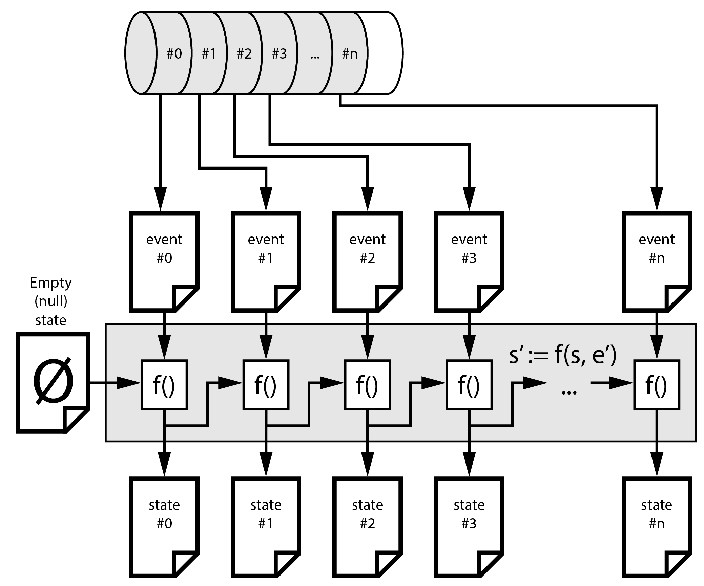
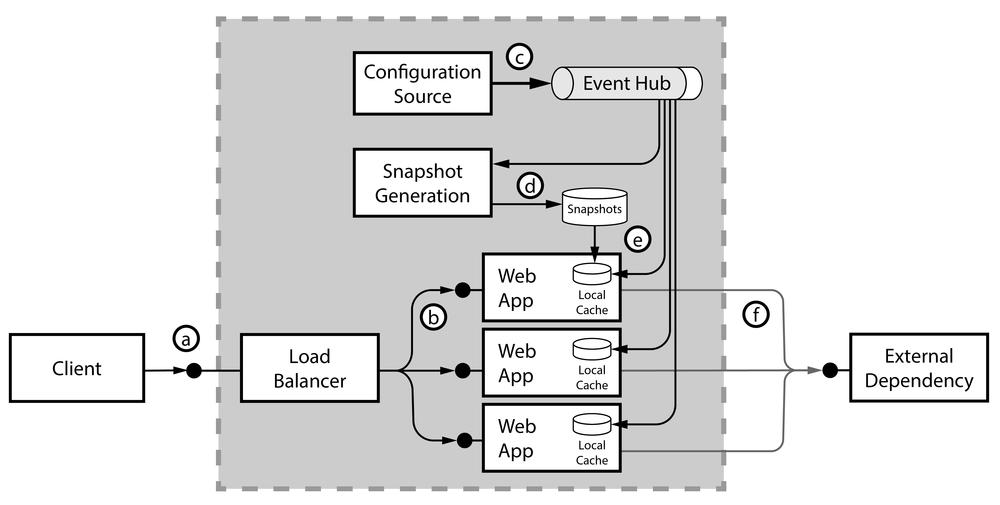
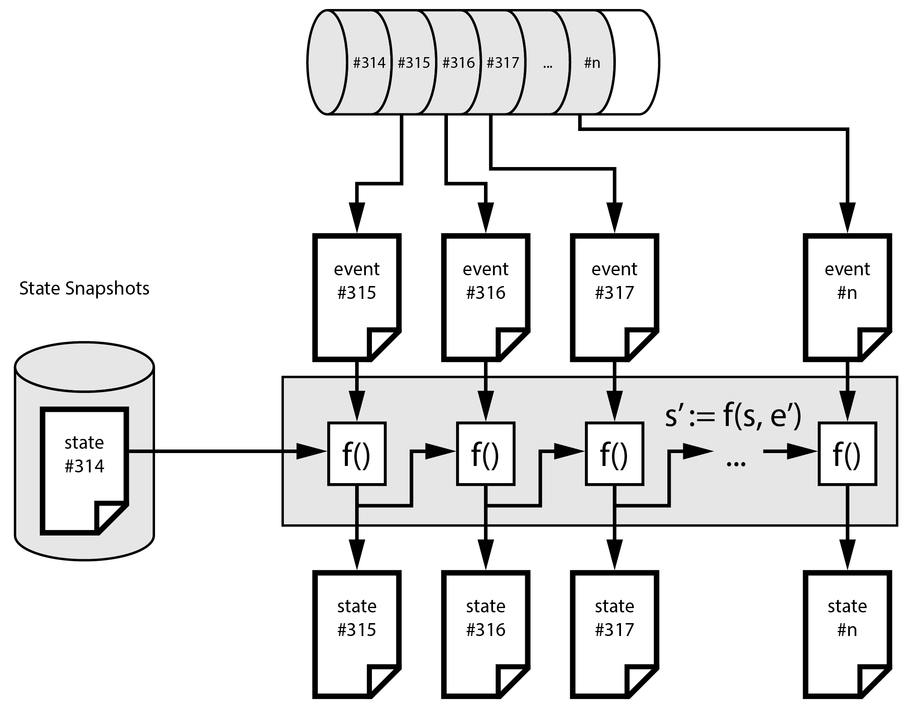
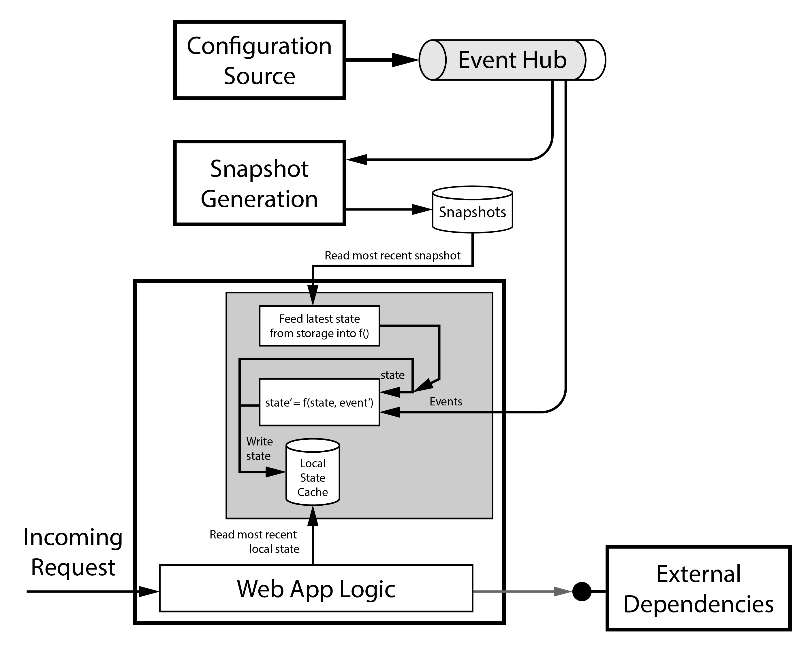
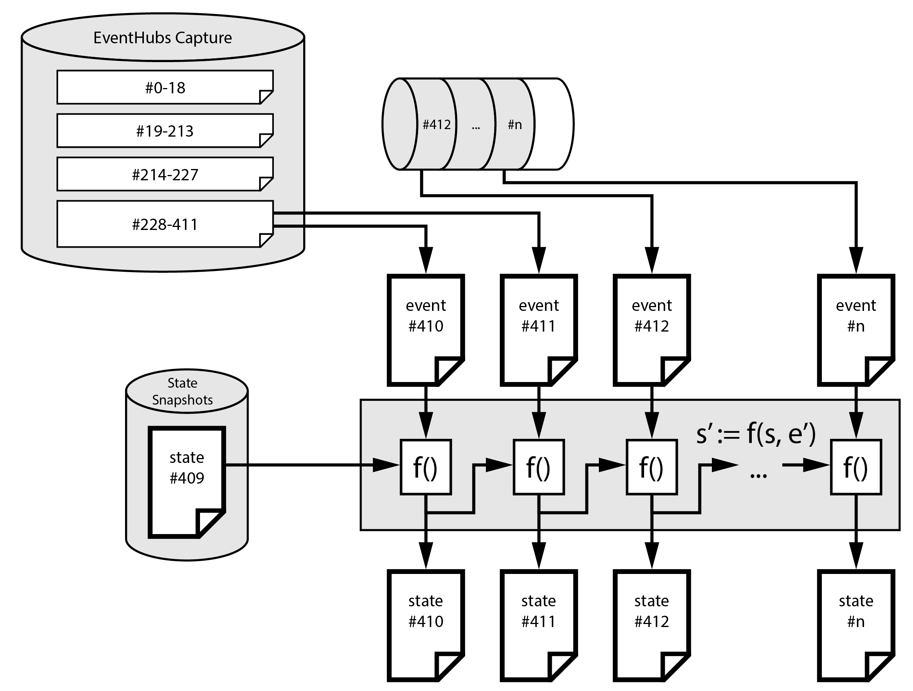

In this article, we describe an architecture modernization, moving from a database-centric access pattern, towards event-sourcing data changes directly into the application's working memory (RAM). 

## Modernization scenario

### Overview

The starting point for our modernization is a 'traditional' web application. The application depends on both internal data (such as a database) and data from external third party APIs. For example, the internal data could represent configuration information necessary for the business logic in the application to handle the responses from the external APIs. That application could be an e-commerce site, which calls various external catalogs for inventory, queries the external data sources, and applies business rules to the responses and the aggregated result. An example of such internal configuration data could be business process rules, or the list of currently active external API endpoints. When the business onboards a new catalog provider, the admin team would update the internal configuration database with the new catalog configuration. 

During request handling, the web app needs to query the internal configuration database to retrieve the current list of external dependencies such as catalogs, business rule configurations, etc. The configuration information can change during normal operations, so the application developer has to work on a strategy to determine how often to run queries against the underlying config database. In the worst case, the web application must query the configuration database multiple times, for example to determine the different external providers and to retrieve per-provider business rules. 

Querying the configuration source on a per-request basis has the advantage to always work on the most recent configuration. Unfortunately, that adds considerable load to the configuration database and increases the end-to-end latency of each request. As a result, it reduces the overall capacity of a web application node.

The following illustration outlines our starting point: 

- Step (a): The client sends requests to the load balancer
- Step (b): The load balancer distributes incoming requests to the application servers running the web application
- Step (c): The web application queries both the configuration source
- Step (d): and the external dependencies. 

The *configuration source* abstractly represents the part of the system that changes the configuration, such as business administrators or automated processes.



*Download an [SVG](../media/eventsourcing-into-memory_01-Regular-SQL.svg) of this architecture.*

### Caching in the ORM

Applications typically access a relational database via technology like an object relational mapper (ORM), such as .NET Entity Framework (EF). ORMs can cache query results in memory, to reduce the number of outgoing database queries. 

The following diagram represents the ORM as a 'local cache' inside the web application:



*Download an [SVG](../media/eventsourcing-into-memory_02-Cached-SQL.svg) of this architecture.*

#### Going to extremes - Caching the whole database

Some customers choose a rather aggressive caching strategy: When their application servers start, they 'pre-warm' the node by **completely** querying all tables in the configuration database and pull the complete data set into the application's working memory. 

This approach removes the need to query the configuration database during the request/response lifecycle, with the web app caching all configuration information locally.

Unfortunately, it also brings significant downsides: 

- **Application start times:** It takes too long to launch the application, due to the pre-warming process, which has to download the full database. During that phase, the application isn't ready to respond to incoming requests. This startup delay can become a problem in scale-out situations: imagine an unforeseen spike in the number of incoming requests, for example due to a TV commercial. When a scaling logic increases the number of web server instances, it would take quite some time until these new nodes can help handling incoming traffic; the spike might already have created problems overloading the other nodes.

- **Database load:** Consider how the load pattern affects the database: During such a scale-out event, a potentially large number of servers intensely queries the database at the same time, potentially overloading the database. A '[thundering herd](https://en.wikipedia.org/wiki/Thundering_herd_problem)' of customers in the web tier leads to a scale-out action and results in a thundering herd of web servers bringing down the database.
- **Configuration updates:** Runtime updates to the configuration database aren't reaching the web application any longer: When the application caches everything once in RAM on startup, and the ORM no longer queries the database, it doesn't pull updated data from the configuration database into the application. In the past, we have seen customers who 'solved' this problem by rebooting all web servers, one after the other, to force each rebooting web server to fetch the entire database *again*, this time with the updated configuration.

## Introducing Event Sourcing into the architecture

Ideally, the web application should keep the configuration information in the working memory. However, we have to avoid the aforementioned disadvantages: 

The application should ...

1. ... start quickly (load the configuration data into RAM), 
2. ... do so without bringing down the configuration system, and 
3. ... configuration changes should be visible as fast as possible (without having to restart the application).

The following approach will help with the second and third requirement (we handle quick startup in the next step):

### Event sourcing

The original definition of Event Sourcing is to 

> *capture all changes to an application state as a sequence of events.* ([by Martin Fowler](https://martinfowler.com/eaaDev/EventSourcing.html))

In this article, we're using the term 'event sourcing' liberally: Simply speaking, all configuration change events in the system change a certain part of the overall state. 

To understand event sourcing better, let's consider the analogy of a bank account: When a customer opens a new account (which is the first event), the account has a zero balance. When the customer receives money (a second event), the system increments the account balance by the given amount. When the customer wires money to a friend, this third event results in having a lower account balance again. The different events (account creation, credit and debit transactions, account closure) represent the banking-specific (domain) events, and the bank records these deltas in the bank's ledger. The account's current balance represents the 'state' of the account. A system replaying (sourcing) all the events from the beginning, in the order in which they appeared, always comes to the same result. The bank's ledger is an 'append-only log'.

### An "append-only log" data structure and service

As first step in refactoring the architecture, we 'replace' the configuration database with an 'append-only log' data structure. 

> The term *'log'* does not refer to log file entries (like an HTTP request log), but should be interpreted like the "captain's log" on a ship, in which all important events are written down sequentially, and historic records (the past) is not modified. 

'Append-only' means that newly arriving events don't modify previously written events. Instead, the system appends new events at the end of the log structure. Given that all the web application servers must read the append-only log, some service must expose that structure over the network. Various services implement this pattern, including Apache Kafka, RabbitMQ Streams, or Azure Event Hubs.

> Such an event stream could loosely be compared to a database's transaction log, in which all state changes to the various database tables are recorded sequentially as well. Replaying the transaction log allows the reconstruction of the database state, like in event sourcing.

### Event Hubs: partitions, sequence numbers and offsets

An Event Hubs instance internally has one or more '[partitions](https://learn.microsoft.com/en-us/azure/event-hubs/event-hubs-scalability#partitions)'. A partition is a unit of compute that hosts a single append-only commit log. When a sender publishes a message to the Event Hubs endpoint, they can specify a 'partition key'. The partition key serves as input to a hashing function that maps the message to one of the partitions. All messages with the same partition key end up in the same partition. 

Event Hubs strictly orders messages when a partition receives them: Each message in a partition gets assigned a unique **sequence number**, a strictly monotonic increasing integer that uniquely identifies the message. For example, the first message ever in a given partition would have sequence number #0, and the next message would have sequence number #1, and so on.

### Pulling events into the application

The illustration demonstrates the concept: 

- Step (c): The configuration source emits state update events into event hub
- Step (d): All running web app nodes receive (pull) their individual copy of these changes 

We augment the application with an active component, which that pulls a copy of the stream from the append-only log structure (Azure Event Hubs service). The component then locally applies these events / updates / deltas to the local copy of the configuration state. 



*Download an [SVG](../media/eventsourcing-into-memory_03-EventSourcing-Pure.svg) of this architecture.*

The application's active component tracks the events' sequence numbers, enforces correct processing order and ensures exactly once processing. The following illustration demonstrates the foundational principle: 

- The system starts with an 'empty' (null) state, represented by the document with the `⌀` symbol. 
- We have a function `f()`, which takes in the previous state (`s`) and an event (`e'`), and generates the next version of the state (`s'`). So the equation is `s' := f(s, e')`. For example, `s_500  = f(s_499, e_500)`, that is, the event #500 would transform state #499 into state #500.
- The logic applies the first event in the partition (`#0`) to the empty `⌀` state, to generate `state #0`, and so forth. Each new event creates a corresponding newer version of the state.



 
*Download an [SVG](../media/eventsourcing-into-memory_07-EventSourcing-Start.svg) of this architecture.*

### Continuously following new messages

Append-only log structures usually offer a mechanism to continuously notify consumers about new messages arriving at the end of the log. In a Unix-based system, you can use `tail -f /var/log/messages` to 'follow the tail' of the log file, that is, to continuously see when some producer appends new lines to the log file. 

In Azure Event Hubs, the consumers remain connected to the Event Hubs via a protocol such as 'AMQP' or 'AMQP over Web Sockets', so that they receive newly arriving messages with minimal latency.

## Resuming operations

The state of the system depends on all events, ever received in the past. To compute the most recent state, we have to start with an empty state store, and then replay all events from the beginning of time until today. 

Replaying all events is an unacceptable approach for practical purposes: when a new node in the web app joins the cluster, it would have to reprocess configuration changes from months ago, just to have an up-to-date understanding of the latest configuration. 

In practice, there's a simple optimization: create state snapshots on a regular cadence. A snapshot is a (versioned) copy of the serialized state. It might say 

>  This file contains 'state #314', and describes how the state looked like after applying all events #0--#314.

To bring snapshot generation into the architecture, we introduce the "snapshot generation" component:



*Download an [SVG](../media/eventsourcing-into-memory_04-EventSourcing-with-Snapshots.svg) of this architecture.*

That component regularly computes the most recent snapshot, and serializes the state into a file in object storage, such as Azure Blob storage.

When a new (uninitialized) web app node starts (or the snapshot generator itself), it first reads the most-recent state snapshot from snapshot storage. That state file carries metadata about which *sequence number* the snapshot corresponds to. After de-serializing the state, the service positions its 'read pointer' at the right sequence number in the event hub partition. 

The following diagram describes that process. After the component reads state #314, it starts reading the events #315 onwards, and applies them as well, to continuously compute to the most up-to-date representation of the state.



*Download an [SVG](../media/eventsourcing-into-memory_08-EventSourcing-ResumeHot.svg) of this architecture.*

### Implementation internals

Think of the internal component running in the web app like this: The function `f()` initially receives the most recent state snapshot, and continuously feeds back the most recent state into itself, alongside with the events coming off the event hub. The most recent state is available within the memory of the application, and the application can access it via a global read-only property or a function call. 

Applying a state update event to the state might touch upon multiple areas of the state data structure. For example, a single update might change two or three data locations within the state type. In the database world that would correspond to a transaction that updates multiple tables or rows. It's important that the web application 'sees' a consistent view of the world. For example, the state must correspond to event #314, or to event #315, but nothing in-between, such as a partially applied event #315.

> Using a functional programming language with immutable (unmodifiable) data structures can be of great help here. Examples of such languages could be F#, Scala, Rust or Elixir. While the term "immutable data structure" might sound wasteful or not very useful, it refers to the programming language's ability to represent state transitions. One can say "Give me a copy of this immutable object, with that property here having a different value". Such property modifications, alongside with the fact that large parts of the state might not change, allow to reuse large parts of the object graph.



*Download an [SVG](../media/eventsourcing-into-memory_05-DataPump.svg) of this architecture.*

### Historic events and Event Hubs Capture

The number of events going into an append-only log data structure can potentially be huge. Therefore, the service operator needs to consider how to deal with this data growth. For example, in an Apache Kafka cluster, one might choose to 'just let it grow' and attach some more hard drives, keeping all the information around. Another approach to handle this challenge is 'log compaction', in which older messages get deleted from a partition. 

Azure Event Hubs addresses this challenge by setting a 'message retention' or '[event retention](https://learn.microsoft.com/en-us/azure/event-hubs/event-hubs-features#event-retention)' period. Event Hubs removes messages that are older than this period from the event hub partition. A reader can no longer 'seek' to them and read them off the partition. The shortest duration is 24 hours, that is, all messages that arrived within that time period are readable from the partition. Older messages (like last week's ones) aren't available here. The maximum retention period varies between 7 days (for Event Hubs Standard) and 90 days (for the Premium and Dedicated SKUs).

In our event sourcing system, it might be necessary to read messages that are older than the retention period. For example, if the snapshot generator didn't run for a longer period of time, the stored snapshots might be too old to resume without missing some events. 

To help with that problem, you can enable **Event Hubs Capture** to fully keep track of the entire history. Enabling the Event Hubs Capture feature forces the Event Hubs service to regularly write older messages as [Apache Avro](https://avro.apache.org/) or [Apache Parquet](https://parquet.apache.org/)-formatted files into Azure Blob storage. 

The following diagram illustrates the practical use:



*Download an [SVG](../media/eventsourcing-into-memory_09-EventSourcing-ResumeFromCapture.svg) of this architecture.*

In this situation, the most recent state snapshot corresponds to event #409, so that the system must process event #410 and following next. Unfortunately, the oldest event in the event hub partition is event #412, so that events #410 and #411 aren't available from the partition directly. 

However, the storage container configured for Event Hubs Capture contains Avro (or Parquet) files containing these events. After the logic feeds the two rather old events into the pipeline, it can 'flip over' to the Event Hubs endpoint for the more recent events.

## When can this pattern be applicable?

The pattern in this document can be helpful in the following situations: 

- You have an application that needs low-latency access to an internal data set.
- You want to keep some information local in the application and reduce the number of database queries.
- The data set is small enough to fit into working memory of your application (without degrading the regular functionality of the application).
- The application needs near-realtime access to changes in the data set.
- Ideally, you can model the data set using a (functional) programming language that offers immutable data types. The advantage of immutable data types is that different threads or tasks in the application have a consistent view into different versions of the data set.

## A concrete sample implementation

A sample solution that implements this pattern is in my GitHub repository [chgeuer/distributed-search](https://github.com/chgeuer/distributed-search). This .NET-based sample in F# implements a distributed search system for an e-commerce site. Customers search for fashion, and the site fans out the search query across multiple third-party search APIs. The system aggregates the external responses into a combined response and applies local business rules. 

### The local state

The system's configuration data ([`FashionBusinessData`](https://github.com/chgeuer/distributed-search/blob/23c2f20c366505b085ecdd3a26f7105e4dd64848/customer/Customer.Domain.Fashion/FashionBusinessData.fs#L8-L11)) represents the markup by type of the fashion item:

```fsharp
type FashionType = string

let TShirt: FashionType = "T-Shirt"
let Pullover: FashionType = "Pullover"
let Throusers: FashionType = "Throusers"

type FashionBusinessData =
    { Markup: Map<FashionType, decimal>
      Brands: Map<string, string>
      DefaultMarkup: decimal }
```

For example, the e-commerce site might add a 2% markup on T-shirts, and 4.3% on trousers.

### The update events

The F# type [`FashionBusinessDataUpdate`](https://github.com/chgeuer/distributed-search/blob/23c2f20c366505b085ecdd3a26f7105e4dd64848/customer/Customer.Domain.Fashion/FashionBusinessData.fs#L18-L21) is a discriminated union that represents all possible configuration updates coming through Event Hubs:

```fsharp
type FashionBusinessDataUpdate =
    | MarkupUpdate of FashionType: FashionType * MarkupPrice: decimal
    | BrandUpdate of BrandAcronym: string * Name: string
    | SetDefaultMarkup of DefaultMarkupPrice: decimal
```

For example, a `MarkupUpdate` event would set a new markup value for a certain `FashionType`, such as increasing the markup for T-shirts to 3%.

### The update function `f()`

The [`update`](https://github.com/chgeuer/distributed-search/blob/510724cf02da83e230ba863edf37d3b7523a9a2c/customer/Customer.Domain.Fashion/FashionBusinessData.fs#L25-L40) function implements the process to transform the previous state into the new state, given an update event:

```fsharp
let update (businessData: FashionBusinessData) (update: FashionBusinessDataUpdate) : FashionBusinessData =
    match update with
        | MarkupUpdate(fashionType, markupPrice) ->
            match markupPrice with
            | price when price <= 0m ->
                { businessData with
                      Markup = businessData.Markup.Remove(fashionType) }
            | price ->
                { businessData with
                      Markup = businessData.Markup.Add(fashionType, price) }
        | BrandUpdate(key, value) ->
            { businessData with
                  Brands = businessData.Brands.Add(key, value) }
        | SetDefaultMarkup newDefaultPrice ->
            { businessData with
                  DefaultMarkup = newDefaultPrice }
```

For example, a `MarkupUpdate` event with a negative price transforms the state so that the `Markup` dictionary no longer contains the entry. 

This model shows how a sequence of multiple updates can transform the state:

```fsharp
let ApplyFashionUpdates (businessData: FashionBusinessData) (updates: IEnumerable<FashionBusinessDataUpdate>) : FashionBusinessData =
   updates
   |> Seq.fold ApplyFashionUpdate businessData
```

### Putting it all together

The [`BusinessDataPump`](https://github.com/chgeuer/distributed-search/blob/510724cf02da83e230ba863edf37d3b7523a9a2c/framework/BusinessDataPump/BusinessDataPump.cs) finally brings all moving pieces together: The application starts a `BusinessDataPump` instance, which internally runs a .NET task to pull events from an Event Hubs partition, and exposes the events as an observable sequence (using Reactive Extensions / Rx.NET). 

The public API to the application is just a [simple property](https://github.com/chgeuer/distributed-search/blob/510724cf02da83e230ba863edf37d3b7523a9a2c/framework/BusinessDataPump/BusinessDataPump.cs#L44):

```csharp
public class BusinessDataPump<TBusinessData, TBusinessDataUpdate>
{
    ...
        
    public BusinessData<TBusinessData> BusinessData { get; private set; }
    
    ...
}
```

The generic type `TBusinessData` in our example is an instance of the immutable `FashionBusinessData` type. This immutability gives each thread in the running application the assurance that the object is a consistent view into the state. 


## Next steps

To learn more about event sourcing, you might consider exploring a related few areas:

- Domain Driven Design (DDD)
- Event Driven Architecture (EDA)
- Command and Query Responsibility Segregation (CQRS)

## Contributors

*Microsoft maintains this article. The following contributors wrote it:*

Principal author: 

 * [Dr. Christian Geuer-Pollmann](https://www.linkedin.com/in/chgeuer/) ([@chgeuer](https://github.com/chgeuer)) | Principal Customer Engineer

## Related resources

- Azure Architecture Center
  - [Partitioning in Event Hubs and Kafka](../../reference-architectures/event-hubs/partitioning-in-event-hubs-and-kafka.yml)
  - The [Event Sourcing pattern](../../patterns/event-sourcing.yml)
  - The [CQRS pattern](../../patterns/cqrs.yml)
- [Event Sourcing, Greg Young, GOTO 2014 Conference (YouTube)](https://www.youtube.com/watch?v=8JKjvY4etTY)
- [Event Sourcing, Martin Fowler](https://martinfowler.com/eaaDev/EventSourcing.html)
